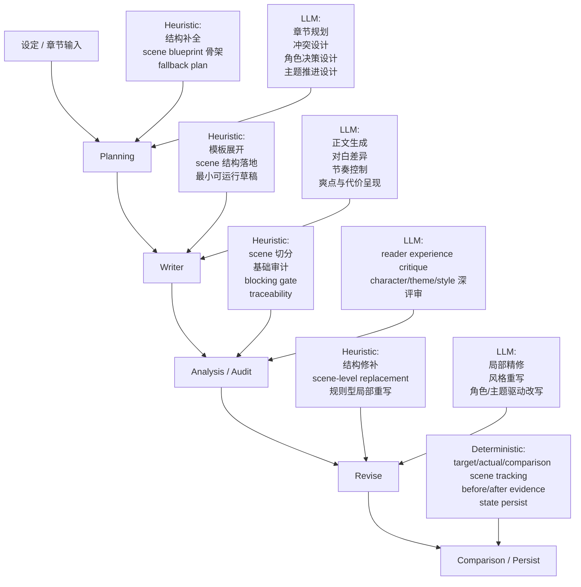

# storylab-next 详细设计

## 设计目标

这个项目要解决的不是“能不能写一章”，而是“怎样建立一套更适合高质量小说生产的独立写作架构”。

当前设计目标：

1. 让 scene 成为最小可控单元
2. 让 character / theme / style 真正进入 generation pipeline
3. 让 revise 不只会整章重写，而能做 scene-level 局部改写
4. 让 comparison 不只解释“改了什么”，还解释“改得值不值”
5. 在保留 deterministic 证据链的前提下，逐步引入 LLM

## 当前架构层次

### CLI 层

- `init-demo`
- `run`
- `plan-next`
- `write-from-plan`
- `writer-cycle`
- `revise-until-pass`
- `revise-cycle`

### Pipeline 层

- `StorylabRunner.run()`
- `StorylabRunner.planNext()`
- `StorylabRunner.writeFromPlan()`
- `StorylabRunner.writerCycle()`
- `StorylabRunner.reviseUntilPass()`
- `StorylabRunner.reviseCycle()`

### Store 层

负责：

- 读取书籍、章节、planning、writer、review、revision
- 读取角色、主题、风格、gate 配置
- 管理 `story/` 输出目录
- 管理 `story/writers-internal/`、`story/revisions/internal/` 与 `final/`
- 读取与回写跨章累计状态

### Module 层

- `ScenePlanner`
- `CharacterEngine`
- `ThemeTracker`
- `StyleEngine`
- `ReaderExperienceCritic`
- `HumanReviewGatekeeper`
- `HistoryBuilder`
- `ChapterPlanner`
- `WriterGenerator`（实现仍位于 `src/core/modules/draft-generator.ts`）
- `SceneAuditor`
- `SettlementAgent`

### Engine 层

- `HeuristicAnalysisEngine` / `OpenAIAnalysisEngine`
- `HeuristicReaderCriticEngine` / `OpenAIReaderCriticEngine`
- `HeuristicPlanningEngine` / `OpenAIPlanningEngine`
- `HeuristicWriterAgent` / `OpenAIWriterAgent`
- `HeuristicReviseEngine` / `OpenAIReviseEngine`

## Heuristic / LLM / Deterministic 分工

当前项目不是“全规则系统”，也不是“默认全链路 LLM 系统”，而是三层分工：

- `heuristic` 负责结构、约束、fallback
- `llm` 负责生成、表达、细腻改写
- `deterministic` 负责证据链、可追踪性与状态落盘

### 当前分工原则

#### Heuristic

适合承担：

- scene blueprint 骨架生成
- fallback planning
- 最小可运行 writer 工作稿
- 规则型 scene audit
- 结构化 revise

它的优势是：

- 稳定
- 可调试
- 易验证

它的局限是：

- 文风机械
- 易模板化
- 不擅长成熟正文生成

#### LLM

适合承担：

- 真正的章节规划
- scene 级冲突设计
- 正文生成
- 局部精修
- 风格控制
- 更深的 reader / character / theme critique

它的价值在于：

- 提升文本质量
- 提升冲突和语言表达的细腻度

#### Deterministic

必须长期保留在代码层的能力：

- target / actual / comparison scene tracking
- prelude / scene blocks / postlude 边界保持
- unchanged scenes 保持
- comparison 的事实层
- history / memory / review / revision 落盘

这些能力不应交给 LLM 主导，否则系统会失去可审计性。

## 核心数据结构

单章分析：

- `ScenePlanItem`
- `CharacterState`
- `ThemeReport`
- `StyleReport`
- `ReaderExperienceReport`
- `GateDecision`

跨章状态：

- `CharacterHistory`
- `ThemeHistory`
- `StoryMemory`
- `ChapterSummaryRecord`
- `ChapterStateDelta`
- `ChronologyLedger`
- `OpenLoopsLedger`

后续跨章连续写作升级路线详见：

- [跨章连续写作路线](/C:/Working/storylab-next/docs/cross-chapter-continuity.md)

章节规划：

- `ChapterPlan`
- `SceneBlueprintItem`

修订与对比：

- `BlockingGateStatus`
- `RevisionTrace`
- `RevisionComparisonReport`
- `SceneRevisionExplanation`

## 跨章连续写作升级方向

当前项目已经有基础跨章状态，但还没有真正完成“整本书连续创作架构”。

这条升级路线的目标架构可以概括为：

- `5 层状态`
- `2 层执行流`

其中：

- `5 层状态` 是：
  - 静态设定层
  - 全书动态状态层
  - 章节层
  - Scene 层
  - 运行时上下文层
- `2 层执行流` 是：
  - 文本生产流
  - 状态结算流

当前更准确的项目定位是：

- 我们已经把“文本生产流”做得比较完整
- 但“状态结算流”仍在补齐中
- 当前最强的是 `Scene 层` 和“章节生产单元”
- 当前最弱的是“全书记账”与“canonical state commit”

下一条明确升级路线是：

1. `Settlement Layer`
   - 在最终提交链中正式生成 `chapter_summary / state_delta / chronology / open_loops`
2. `State-Driven Planning`
   - 让 `plan-next` 基于状态账本，而不是只依赖前文拼接
   - 当前已落地初版 `ContextAssembler` 与 `context-pack`
   - `plan-next` 会先生成 `story/context/chapter-XXXX.context-pack.json`
   - planner 与 writer 现在通过同一份 `context-pack` 读取：
     - recent chapter summaries
     - chronology slice
     - active open loops
     - relevant character states
     - current book phase（当前先 heuristic 推断）
3. `Continuity Audit`
  - 新增独立于 reader 的 continuity gate
  - 当前最小实现已经落地：
    - `ContinuityAgent`
    - `story/continuity/chapter-XXXX.continuity-report.json`
    - continuity fail 时阻止 canonical `persist`
  - 当前已检查：
    - timeline
    - scene coverage
    - open loop continuity
    - tracked character state continuity
4. `Re-settlement`
  - revise 后重新结算状态，只认最终正文对应的账本

这条路线不会替换当前单章主链，而是接在当前主链之后：

`plan -> writer -> analysis -> reader -> revise -> gate -> settlement -> continuity audit -> persist canonical state -> final prose -> plan next chapter`

当前已经落地的部分是 `Phase 1: Settlement Layer` 初版：

- canonical persist 前生成 `chapter_summary`
- canonical persist 前生成 `chapter_state_delta`
- 增量写回 `chronology`
- 增量写回 `open_loops`
- `plan-next` 开始读取 recent chapter summaries / chronology / open loops
- `Phase 3` 最小 continuity gate 已经接在 settlement 后

## Character / Theme / Style 如何进入主链

这部分是当前架构的核心，它们不再只是“报告层”。

### Character 约束

每个 `sceneBlueprint` 至少包含：

- `drivingCharacter`
- `opposingForce`
- `decision`
- `cost`
- `relationshipChange`

这意味着 writer 与 revise 必须围绕：

- 谁推动 scene
- 谁制造阻力
- 角色做了什么选择
- 这个选择付出了什么代价
- 关系如何变化

当前更准确的说法是：

- revise 会直接消费 scene blueprint 中编码好的 character 约束
- history 会作为辅助输入进入 LLM / heuristic revise
- 但还不能过度宣称成“所有 character logic 都直接由 history 驱动”

### Theme 约束

每个 `sceneBlueprint` 至少包含：

- `thematicTension`
- `valuePositionA`
- `valuePositionB`
- `sceneStance`

这意味着 scene 不只承担事件推进，也承担价值冲突推进。

Theme 进入主链的方式是：

- planning 阶段写进 scene blueprint
- writer 阶段通过行为 / 对话体现
- revise 阶段作为局部重写方向

### Style 约束

`ChapterPlan` 包含：

- `styleProfile`

每个 `sceneBlueprint` 还包含：

- `styleDirective`

当前 style 约束重点包括：

- narration style
- dialogue style
- pacing profile
- description density
- tone constraints

当前更准确的说法是：

- style 已进入 writer / revise 约束
- 但“局部风格重写器”还在继续强化中

## 章节规划设计

`planNext(bookId, targetChapterNumber)` 会读取累计状态，生成：

- chapter mission
- reader goal
- scene blueprint
- character intent
- theme intent
- thematic question
- style profile
- gate note

输出文件：

- `story/planning/chapter-XXXX.chapter-plan.json`

这个阶段负责把“过去发生了什么”和“下一章该怎么写”接起来。

## 起草设计

`writeFromPlan(bookId, targetChapterNumber)` 会读取：

- `chapter-plan.json`
- `character-history.json`
- `theme-history.json`

然后由 `writer engine` 生成草稿并写入：

- `story/writers-internal/000X_<title>.raw.md`

### writer 阶段必须消费的硬输入

- scene goal / conflict / turn / result
- new information / emotional shift / POV
- driving character / opposing force / decision / cost / relationship change
- thematic tension / value positions / scene stance
- style directive / style profile

这使得 `scene -> writer` 的约束已经是硬输入，而不是附属说明。

## scene-level revise 设计

当前 revise 已支持“只改一个 scene”。

### revise 输入

每个待修 scene 的输入包含：

- 原 scene 文本
- scene blueprint
- 该 scene 的 critique 问题列表
- character constraints
- theme constraints
- style constraints

### revise 行为

- 优先只处理 blocking scenes 或 target scenes
- 整条 revise 闭环按串行顺序运行，不并行触发多个 LLM agent
- 不改其他 scene
- 只替换目标 scene 文本
- 保持 prelude / unchanged scenes / postlude
- 记录 target / actual / comparison 三套 scene 集合

### revise 输出

- revised writer working
- `RevisionTrace`
- scene-level comparison

## comparison 设计

当前 comparison 已分成两层：

### rewriteFacts

用于程序审计：

- target scene numbers
- actual rewritten scene numbers
- comparison scene numbers
- unchanged scene numbers
- reviewed but not rewritten scenes
- scene alignment

### rewriteInterpretation

用于人类阅读：

- summary
- improved
- unresolved
- benefit summary
- 每个 scene 的 explanation

每个 `sceneChanges` 当前至少会输出：

- `beforeProblems`
- `appliedRewriteStrategy`
- `textualChangeEvidence`
- `characterChange`
- `themeChange`
- `styleChange`
- `postRewriteAssessment`
- `beforeExcerpt`
- `afterExcerpt`

## Blocking Gate 最小版

当前 gate 采用 `reader` 优先策略。

第一层是 `reader gate`：

- `hook >= 6`
- `momentum >= 6`
- `emotionalPeak >= 6`
- `suspense >= 6`
- `memorability >= 6`

第二层是 `scene audit gate`：

- 如果只剩质量型问题，例如“无决策 / 无代价 / 主题偏弱 / 爽点不足”，在 reader 已过线时会降为 `advisory`
- 只有硬结构问题会继续阻断，例如：
  - scene 漏写或计划覆盖失败
  - scene 边界错乱
  - 严重 POV 漂移

因此当前行为是：

- `writer-cycle` / `revise-cycle` / `revise-until-pass` 默认先看 reader 是否过线
- 如果 reader 已过线且不存在硬结构阻断，系统可以直接通过，不再继续 revise
- 只有在 gate 仍为 blocking 时，才继续进入 scene-level revise

## 串行执行、进度与重试

当前自动循环不做并行 LLM 调度，而是严格串行执行：

`writer -> analysis -> reader -> scene audit -> revise -> re-analysis -> re-reader -> gate`

这样做的目的有两个：

- 保证每一步都建立在上一轮稳定产物之上
- 让调试信息、scene traceability 与 comparison 保持一致

CLI 在运行时会输出：

- 当前阶段
- reader 分数
- reader summary 与建议
- scene audit 问题
- target scene / actual rewritten scene
- retry 日志

LLM 链路当前还内置了：

- timeout
- retry
- 脏 JSON 修复
- heuristic fallback

## 当前边界

已经完成：

- 单章增强分析
- 跨章累计状态
- 章节规划
- 起草
- 修订闭环
- scene-level revise
- scene-level traceability
- rewrite effectiveness 第一版

仍需继续加强：

- heuristic revise 仍偏结构化改写
- style local rewrite 仍可更细
- no-op / regression 检测仍需继续强化
- 更成熟的 LLM rewrite 质量尚未验证到位

